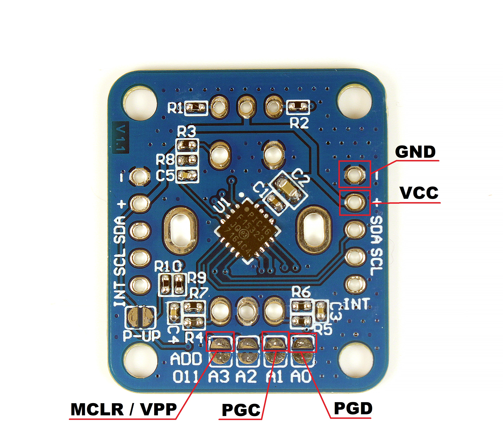

# I2C Encoder Firmware

In this folder, there is the project folder of the MPLAB X IDE and the source files of the firmware running on the PIC16F15323.
For connect the programmer, like the PICkit 3 follow the following image:
 
