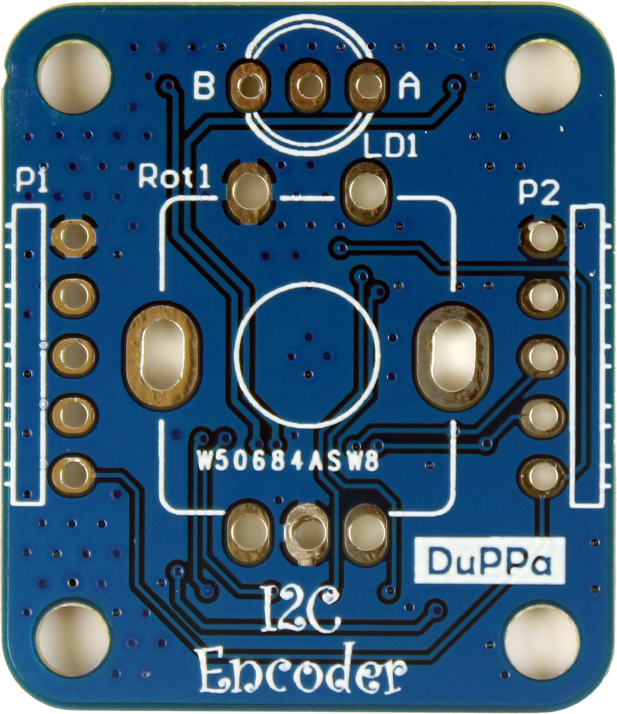
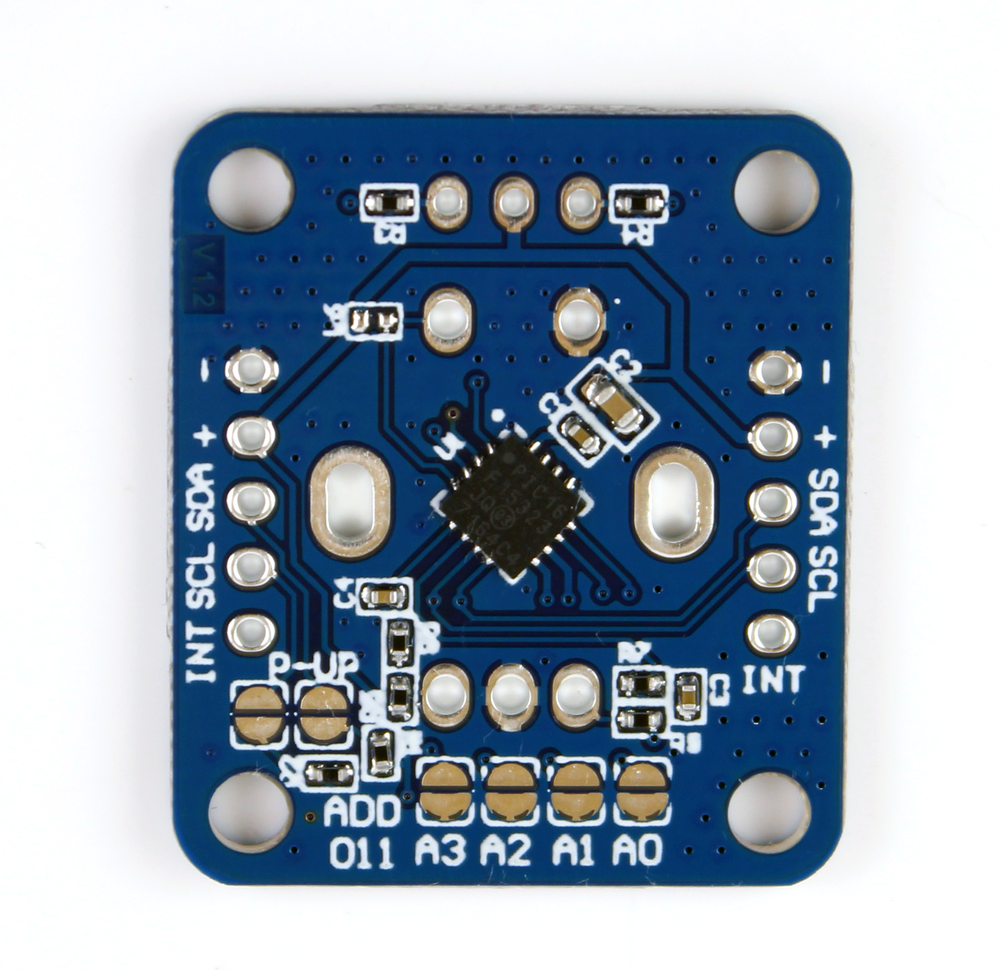
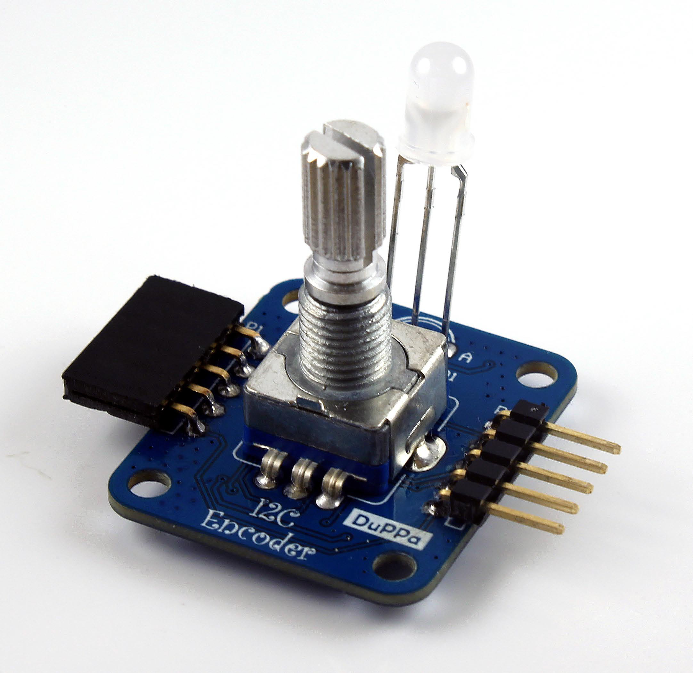
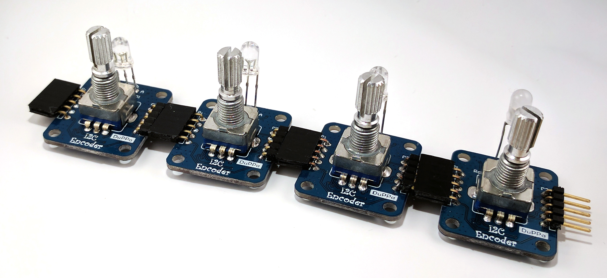

# I2C Encoder
--------------------------------------------------------------------------------
 
    
  

## Introduction

The I2C Encoder is a small board where you can use a classical mechanical encoder with a I2C bus. This device
includes also the possibility to add a bi-color LED and user can set luminosity through the I2C bus. It’s possible to connect up
to 16 boards in cascade and read all of them with the same I2C bus.
The I2C Encoder have a series of 8 bit registers where it is possible to configure the parameters and three 32
bit of registers. The 32 bit registers are the most important because they store the counter value, the maximum
and minimum threshold. Every time when the encoder is moved at least one step, the counter value is increased or
decreased according to the rotation direction. When the counter value is outside of the limit set by the threshold,
the counter value can be wrapped or can stuck on the threshold valued reached.
The I2C Encoder also has an open-drain interrupt pin. It is set to logic low every time when the encoder is rotated
or pushed. The status register must be read by the master to check what is changed.

## Where you can get this board?
It's possible to buy this board here:
* [Tindie](https://www.tindie.com/products/10730/)
* [eBay](https://www.ebay.com/itm/172973161890)

## Repository Structure
* [Arduino Library:](/Arduino%20Library) Ready to use library for the Arduino boards, with some examples.
* [Firmware:](/Firmware) Project folder of Microchip MPLAB X containg the code running inside of the PIC16F15323
* [Hardware:](/Hardware) Folder containing the gerber file, schematic and BOM. The original project is not available.
* [Datasheet EncoderI2C:](EncoderI2C%20v1.3.pdf) Datasheet of the board with the description of the registers and some useful information.

**If you want to donate for my work, i would really appreciate it. You can donate here with this link. Thank you!**

